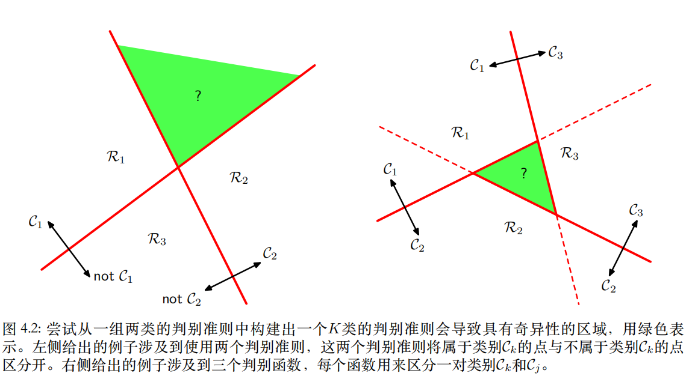

[toc]

## 0. 引论

### 0.1 分类线性模型

决策面是输入向量$\boldsymbol w$的线性函数

### 0.2 目标向量

- 二分类问题：$t \in \{0, 1\}$
- K分类问题
  - 使用“1-of-K”编码规则
  - 如$\boldsymbol t = (0, 1, 0, 0)^T$
  - 可以把$t_k$看成分类结果$\mathcal C_k$的概率

## 1. 判别函数

判别函数是一个以向量$\boldsymbol x$为输入，把它分配到$K$个类别中的每一个类别（记作$\mathcal C_k$）的函数。本章讨论线性判别函数（linear discriminant function）。

### 1.1 二分类

线性判别函数最简单的形式是输入向量的线性函数
$$
y(\boldsymbol x) = \boldsymbol w^T \boldsymbol x + w_0
$$

- $\boldsymbol w$被称为权向量 (weight vector)，必定与决策面正交
- $w_0$被称为偏置 (bias)，相反数被称为阈值 (threshold)

如果$y(\boldsymbol x) \geq 0$，属于$\mathcal C_1$，反之属于$\mathcal C_2$。

引入一个虚“输入”$x_0=1$，定义$\tilde {\boldsymbol w} = (w_0, \boldsymbol w), \tilde {\boldsymbol x} = (x_0, \boldsymbol x)$，从而
$$
y(\boldsymbol x) = \tilde {\boldsymbol w}^T \tilde {\boldsymbol x}
$$

### 1.2 多分类

使用$K$类判别函数，由$K$个线性函数组成
$$
y_k(\boldsymbol x) = \boldsymbol w^T_k \boldsymbol x + w_{k0}
$$
对于点$\boldsymbol x$，如果$\forall j\neq k, \quad s.t. y_k(\boldsymbol x) \gt y_j(\boldsymbol x)$，那么就分类到$\mathcal C_k$。

### 1.3 用于分类的最小平方方法

