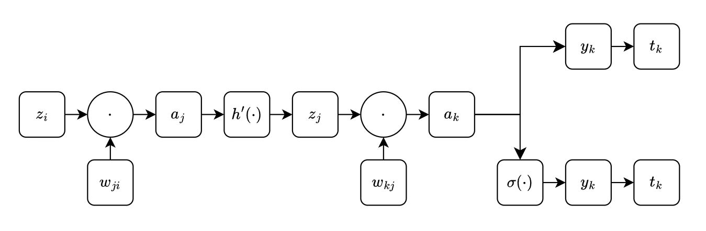

[toc]

## 1. 前馈神经网络

神经网络可以被描述为一系列线性变换。

构造输入变量$x_1, \dots, x_D$的$M$个线性组合，形式为
$$
a_j = \sum^D_{i=1} w^{(1)}_{ji} x_i + w^{(1)}_{j0}
$$
其中$j=1,\dots,M$，且上标$(1)$表示对应的参数是神经网络的第⼀”层“。

- $w^{(1)}_{ji}$：权 (weight)
- $w^{(1)}_{j0}$：偏置 (bias)
- $a_j$：激活 (activation)

每个激活使用一个可微的非线性激活函数$h(\cdot)$进行变换
$$
z_j = h(a_j)
$$
这些量对应于基函数的输出，这些基函数在神经网络中被称为隐含单元 (hidden unit)，再次线性组合，得到输出单元激活
$$
a_k = \sum^M_{j=1} w^{(2)}_{kj}z_j + w^{(2)}_{k0}
$$
其中$k=1,\dots,K$，且$K$是输出的总数量。这个变换对应于神经网络的第二层。最后，选择一个恰当的激活函数对输出单元进行变换，得到一组输出$y_k$。

- 对于标准的回归问题，激活函数是恒等函数，于是
  $$
  y_k = a_k
  $$

- 对于多个二分类问题，每个**输出**单元激活使用logistic sigmoid函数
  $$
  \sigma(a) = \frac{1}{1 + \exp(-a)}
  $$

- 对于多类问题，使用softmax激活函数
  $$
  
  $$

结合各个阶段，得到整体的网络函数，以sigmoid输出单元激活函数为例，整体的网络函数为
$$
y_k(\boldsymbol x, \boldsymbol w) = \sigma \left( \sum^M_{j=1}w^{(2)}_{kj}h \left( \sum^D_{i=1} w^{(1)}_{ji}x_i + w^{(1)}_{j0} \right) +w^{(2)}_{k0} \right)
$$

## 2. 网络训练

