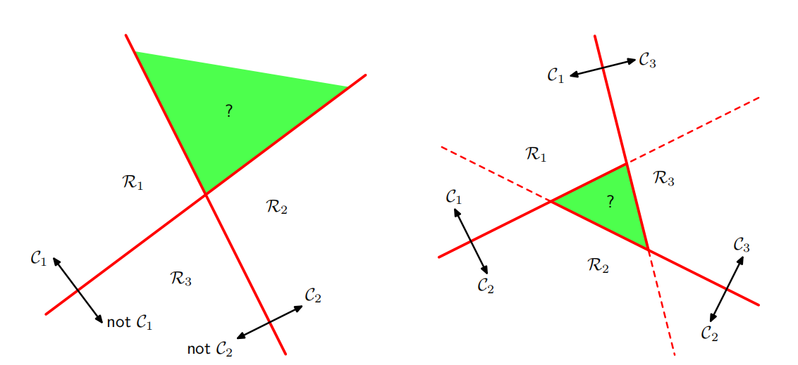

## Question 1

$$
L(\mathbf w, \lambda) = \mathbf w^\text T(\mathbf m_2-\mathbf m_1) + \lambda(\mathbf w^\text T \mathbf w - 1)
$$

$$
\frac{\partial}{\partial \mathbf w}L(\mathbf w, \lambda) =\mathbf m_2-\mathbf m_1 + 2\lambda\mathbf w = 0
$$

Hence,
$$
\mathbf w = -\frac{1}{2\lambda}(\mathbf m_2-\mathbf m_1) \propto (\mathbf m_2-\mathbf m_1)
$$

## Question 2

$$
\begin{align}
J(\boldsymbol w) &= \frac{(m_2 - m_1)^2}{s^2_1 + s^2_2}
\\&=
\frac{(\boldsymbol w^T \boldsymbol m_2 - \boldsymbol w^T \boldsymbol m_1)^2}{\sum_{n\in\mathcal C_1}(\boldsymbol w^T \boldsymbol x_1-\boldsymbol w^T\boldsymbol m_1) + \sum_{n\in\mathcal C_2}(\boldsymbol w^T \boldsymbol x_2-\boldsymbol w^T\boldsymbol m_2)}
\\&=
\frac{\boldsymbol w^T (\boldsymbol m_2 - \boldsymbol m_1)(\boldsymbol m_2 - \boldsymbol m_1)^T \boldsymbol w}{\boldsymbol w^T \left( \sum_{n\in\mathcal C_1}(\boldsymbol x_1-\boldsymbol m_1) + \sum_{n\in\mathcal C_2}(\boldsymbol x_2-\boldsymbol m_2) \right) \boldsymbol w}
\\&= 
\frac{\boldsymbol w^T \boldsymbol S_B \boldsymbol w}{\boldsymbol w^T \boldsymbol S_W \boldsymbol w}
\end{align}
$$

## Question 3

For a point $\phi_n$ from $\mathcal C_k$,
$$
p(\phi_n, \mathcal C_k) = p(\mathcal C_k)p(\phi_n | \mathcal C_k) = \pi_k \mathcal p(\phi_n | \mathcal C_k)
$$
so the likelihood function is
$$
p(\{\phi_n, \mathbf t_n\}| \boldsymbol \pi, \boldsymbol \mu, \Sigma) = \prod^N_{n=1} \prod^K_{k=1} \left[\pi_k p(\phi_n | \mathcal C_k)\right]^{t_{nk}}
$$
Take the log-likelihood
$$
\sum^N_{n=1} \sum^K_{k=1} [t_{nk} \ln\pi_k + t_{nk}\ln p(\phi_n | \mathcal C_k)]
$$
As $\sum^K_{k=1} \pi_k = 1$, we use Lagrange Multiplier to maximize
$$
L(\pi_i, \lambda) = \sum^N_{n=1} \sum^K_{k=1} [t_{nk} \ln\pi_k + t_{nk}\ln p(\phi_n | \mathcal C_k)] + \lambda (\sum^K_{k=1} \pi_k - 1)
$$

$$
\frac{\partial}{\partial \lambda}L(\pi_i, \lambda) = \sum^K_{k=1}\pi_k - 1 = 0
\\
\frac{\partial}{\partial \pi_i}L(\pi_i, \lambda) = \frac{\sum^N_{n=1}t_{ni}}{\pi_i} + \lambda = 0
$$

$$
\pi_i = - \frac{\sum^N_{n=1}t_{ni}}{\lambda} = -\frac{N_i}{\lambda}
$$

Since
$$
\sum^K_{k=1} \pi_k = \sum^K_{k=1} -\frac{N_i}{\lambda} = - \frac{N}{\lambda} = 1
$$
then $\lambda = -N$

Hence, 
$$
\pi_i = \frac{N_i}{N}
$$

## Question 4

$$
\begin{align}
\frac{\partial}{\partial a}\sigma(a) &= \frac{e^{-a}}{(1 + e^{-a})^2} 
\\&= \frac{e^{-a}}{1 + e^{-a}} \frac{1}{1 + e^{-a}}
\\&= \frac{e^{-a}}{1 + e^{-a}} (1 - \frac{e^{-a}}{1 + e^{-a}})
\\&= \sigma(1-\sigma)
\end{align}
$$

## Question 5

$$
y_n = \sigma(a_n) \\
a_n = \boldsymbol w^T \boldsymbol \phi_n
$$

$$
\frac{\partial y_n}{\partial \boldsymbol w} = \frac{\partial y_n}{\partial \boldsymbol a_n} \frac{\partial a_n}{\partial \boldsymbol w} = 
y_n(1-y_n) \phi_n
$$

$$
\begin{align}
\nabla \mathbb E(\boldsymbol w) &= -\sum^N_{n=1} \left(\frac{t_n}{y_n} \frac{\partial y_n}{\partial \boldsymbol w} - \frac{1 - t_n}{1 -y_n} \frac{\partial y_n}{\partial \boldsymbol w}\right)
\\&= -\sum^N_{n=1} \left( t_n(1-y_n) - (1-t_n)y_n \right)\phi_n
\\&= \sum^N_{n=1}(y_n - t_n)\phi_n
\end{align}
$$

## Question 6

## Question 7

Proof by contradiction

If their convex hulls intersect, then
$$
\exist \boldsymbol y,\quad s.t. \boldsymbol y = \sum_n\alpha_n \boldsymbol x^n = \sum_m \beta_n \boldsymbol z^n
$$
where $\alpha, \beta > 0$ and $ \sum_n\alpha_n = \sum_m \beta_n =1$.

Assume $\{\boldsymbol x^n\}$ and $\{\boldsymbol z^m\}$ are linearly separable, there exists a vector $\hat{\boldsymbol w}$ and a scalar $w_0$ such that $\hat{\boldsymbol w}^T \boldsymbol x^n + w_0 > 0$ for all $\boldsymbol x^n$, and $\hat{\boldsymbol w}\boldsymbol z^m + w_0 < 0$ for all $\boldsymbol z^m$.

We figure out 
$$
\sum_n\hat{\boldsymbol w}^T \alpha_n \boldsymbol x^n + \sum_n \alpha_n w_0 = \sum_n\hat{\boldsymbol w}^T \boldsymbol y + w_0
> 0 \\
\sum_m\hat{\boldsymbol w}^T \beta_m \boldsymbol z^m + \sum_m \beta_m w_0 = \sum_m\hat{\boldsymbol w}^T \boldsymbol y + w_0 < 0 \\
$$
It leads a contradiction.

Hence, if their convex hulls intersect, the two sets of points cannot be linearly separable, and conversely that, if they are linearly separable, their convex hulls do not intersect.

