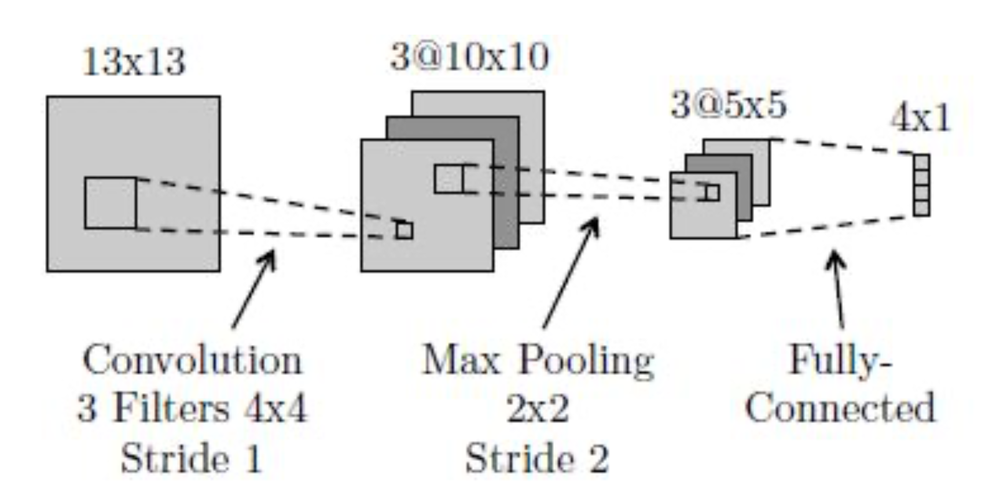

# CS405 Homework 5

*Course: Machine Learning(CS405) - Professor: Qi Hao*

SID:12110813

Name:刘圣鼎

## Question 1

Consider a regression problem involving multiple target variables in which it is assumed that the distribution of the targets, conditioned on the input vector x, is a Gaussian of the form

$$p(\mathbf{t|x,w}) = \mathcal N(\mathbf{t|y(x,w), \Sigma)}$$

where $\mathbf{y(x,w)}$ is the output of a neural network with input vector $\mathbf x$ and wight vector $\mathbf w$, and $\mathbf \Sigma$ is the covariance of the assumed Gaussian noise on the targets. 

(a) Given a set of independent observations of $\mathbf x$ and $\mathbf t$, write down the error function that must be minimized in order to find the maximum likelihood solution for $\mathbf w$, if we assume that $\mathbf \Sigma$ is fixed and known. 

(b) Now assume that $\mathbf \Sigma$ is also to be determined from the data, and write down an expression for the maximum likelihood sol

ution for $\mathbf \Sigma$. (Note: The optimizations of $\mathbf w$ and $\mathbf \Sigma$ are now coupled.

### Answer:

**(a)** For a regression problem with multiple target variables where the conditional distribution of the targets is a Gaussian, the likelihood of observing the target vector $$ \mathbf{t} $$ given the input vector $$ \mathbf{x} $$ and the weight vector $$ \mathbf{w} $$ is:

$$ p(\mathbf{t|x,w}) = \mathcal{N}(\mathbf{t|y(x,w), \Sigma}) $$

The likelihood for a single data point $$ (\mathbf{x}_n, \mathbf{t}_n) $$ is given by:

$$ p(\mathbf{t}_n|\mathbf{x}_n,\mathbf{w}) = \frac{1}{(2\pi)^{D/2}|\mathbf{\Sigma}|^{1/2}} \exp\left\{-\frac{1}{2}(\mathbf{t}_n - \mathbf{y}(\mathbf{x}_n,\mathbf{w}))^\top \mathbf{\Sigma}^{-1} (\mathbf{t}_n - \mathbf{y}(\mathbf{x}_n,\mathbf{w}))\right\} $$

where $$ D $$ is the dimensionality of the target vector $$ \mathbf{t} $$, and $$ |\mathbf{\Sigma}| $$ is the determinant of the covariance matrix $$ \mathbf{\Sigma} $$.

To find the maximum likelihood solution for $$ \mathbf{w} $$, we take the product of the likelihoods over all $$ N $$ observations and then take the negative logarithm to obtain the error function:

$$ E(\mathbf{w}) = -\log \prod_{n=1}^N p(\mathbf{t}_n|\mathbf{x}_n,\mathbf{w}) $$

$$ E(\mathbf{w}) = \frac{N}{2}\log|\mathbf{\Sigma}| + \frac{1}{2} \sum_{n=1}^N (\mathbf{t}_n - \mathbf{y}(\mathbf{x}_n,\mathbf{w}))^\top \mathbf{\Sigma}^{-1} (\mathbf{t}_n - \mathbf{y}(\mathbf{x}_n,\mathbf{w})) + \text{const} $$

 Since $$ |\mathbf{\Sigma}| $$ is constant and known, we can ignore the first term during optimization, so the error function simplifies to the sum of the squared errors between targets and network outputs:

$$ E(\mathbf{w}) = \frac{1}{2} \sum_{n=1}^N (\mathbf{t}_n - \mathbf{y}(\mathbf{x}_n,\mathbf{w}))^\top \mathbf{\Sigma}^{-1} (\mathbf{t}_n - \mathbf{y}(\mathbf{x}_n,\mathbf{w})) $$

Minimizing this error function with respect to $$ \mathbf{w} $$ will give the maximum likelihood solution for the weight vector $$ \mathbf{w} $$.

**(b)** To find the maximum likelihood solution for $$ \mathbf{\Sigma} $$, we differentiate the log-likelihood with respect to $$ \mathbf{\Sigma} $$ and set the derivative to zero. 

For the given Gaussian distribution, the log-likelihood of $$ \mathbf{\Sigma} $$ is proportional to: 

$$ \log p(\mathbf{t}|\mathbf{x},\mathbf{w},\mathbf{\Sigma}) = -\frac{N}{2}\log|\mathbf{\Sigma}| - \frac{1}{2} \sum_{n=1}^N (\mathbf{t}_n - \mathbf{y}(\mathbf{x}_n,\mathbf{w}))^\top \mathbf{\Sigma}^{-1} (\mathbf{t}_n - \mathbf{y}(\mathbf{x}_n,\mathbf{w})) $$

Differentiating and setting the derivative equal to zero yields:

 

$$ \frac{\partial}{\partial \mathbf{\Sigma}} \left( -\frac{N}{2}\log|\mathbf{\Sigma}| - \frac{1}{2} \sum_{n=1}^N (\mathbf{t}_n - \mathbf{y}(\mathbf{x}_n,\mathbf{w}))^\top \mathbf{\Sigma}^{-1} (\mathbf{t}_n - \mathbf{y}(\mathbf{x}_n,\mathbf{w})) \right) = 0 $$

 

$$ -\frac{N}{2} \mathbf{\Sigma}^{-1} + \frac{1}{2} \mathbf{\Sigma}^{-1} \left( \sum_{n=1}^N (\mathbf{t}_n - \mathbf{y}(\mathbf{x}_n,\mathbf{w}))(\mathbf{t}_n - \mathbf{y}(\mathbf{x}_n,\mathbf{w}))^\top \right) \mathbf{\Sigma}^{-1} = 0 $$

 

$$ \mathbf{\Sigma} \sum_{n=1}^N (\mathbf{t}_n - \mathbf{y}(\mathbf{x}_n,\mathbf{w}))(\mathbf{t}_n - \mathbf{y}(\mathbf{x}_n,\mathbf{w}))^\top = N \mathbf{\Sigma}^2 $$

 

From here, the maximum likelihood solution for $$ \mathbf{\Sigma} $$ is the sample covariance matrix of the residuals:

 

$$ \mathbf{\Sigma}_{ML} = \frac{1}{N} \sum_{n=1}^N (\mathbf{t}_n - \mathbf{y}(\mathbf{x}_n,\mathbf{w}))(\mathbf{t}_n - \mathbf{y}(\mathbf{x}_n,\mathbf{w}))^\top $$

 

## Question 2

The error function for binary classification problems was derived for a network having a logistic-sigmoid output activation function, so that $0 \leq y(\mathbf{x,w}) \leq 1$, and data having target values $t \in \{0,1\}$. Derive the corresponding error function if we consider a network having an output $-1 \leq y(\mathbf{x,w}) \leq 1$ and target values $t = 1$ for class $\mathcal C_1$ and $t = -1$ for class $\mathcal C_2$. What would be the appropriate choice of output unit activation function? 

**Hint.** The error function is given by:

$$E(\mathbf w) = -\sum^N_{n=1}\{t_n\mathrm{ln}y_n + (1-t_n)\mathrm{ln}(1 - y_n)\}.$$

### Answer:

Given the hint and the conditions specified, we need to adjust the error function for the output range of $$[-1, 1]$$ and target values $$ t $$ of 1 and -1.

The error function provided is the cross-entropy error function used for binary classification with outputs in the range $$[0, 1]$$ and targets of 0 or 1. However, we want an error function that accommodates our network's output range and target values.

One way to adjust the error function is to map the current output of the network, $$y$$, from the range $$[-1, 1]$$ to $$[0, 1]$$ and then apply the given error function. This mapping can be done using the following transformation:

$$ y' = \frac{y + 1}{2} $$

Here, $$y'$$ is the transformed output, which will lie in the range $$[0, 1]$$. The targets also need to be transformed accordingly, from $$ t \in \{-1, 1\} $$ to $$ t' \in \{0, 1\} $$, using the same transformation:

$$ t' = \frac{t + 1}{2} $$

With this transformation, the error function using the logistic-sigmoid output activation becomes applicable. Substituting $$y'$$ and $$t'$$ into the given error function, we get:

$$ E(\mathbf w) = -\sum^N_{n=1}\left\{t'_n\mathrm{ln}y'_n + (1-t'_n)\mathrm{ln}(1 - y'_n)\right\} $$

For the activation function of the output unit that maps its input into the range [-1, 1], a suitable choice is the hyperbolic tangent function ($$ \tanh $$), which naturally outputs values in this range:

$$ y(\mathbf{x,w}) = \tanh(z) = \frac{e^{z} - e^{-z}}{e^{z} + e^{-z}} $$

where $$ z $$ is the input to the output unit before the activation function is applied.

The hyperbolic tangent function is similar in shape to the logistic-sigmoid function but is scaled to output values in the range [-1, 1] instead of [0, 1]. This makes it an appropriate choice for the given problem. 

## Question 3

Verify the following results for the conditional mean and variance of the mixture density network model.

(a) $$\mathbb E[\mathbf{t|x}] = \int \mathbf tp(\mathbf{t|x})\mathrm d \mathbf t = \sum_{k=1}^{K} \pi_k(\mathbf x)\mu_k(\mathbf x).$$

(b) $$s^2(\mathbf x) = \sum^K_{k=1}\pi_k(\mathbf x)\{\sigma^2_k(\mathbf x) + \Arrowvert\mu_k(\mathbf x) - \sum^K_{l=1}\pi_l(\mathbf x)\mu_l(\mathbf x)\Arrowvert^2\}.$$

### Answer:

To prove these results, we can start with the definition of Gaussian mixture models. For a Gaussian mixture model with an objective variable $$\mathbf{t} $$ with $\mathbf{x}$ as a condition, we have:

$$ p(\mathbf{t|x}) = \sum_{k=1}^{K} \pi_k(\mathbf{x}) \mathcal{N}(\mathbf{t}; \mu_k(\mathbf{x}), \sigma_k^2(\mathbf{x})) $$

**(a)** **The proof for the conditional expectation $$ \mathbb{E}[\mathbf{t|x}] $$ **：

$$ \mathbb{E}[\mathbf{t|x}] = \int \mathbf{t} p(\mathbf{t|x}) \, d\mathbf{t} $$

$$ = \int \mathbf{t} \left( \sum_{k=1}^{K} \pi_k(\mathbf{x}) \mathcal{N}(\mathbf{t}; \mu_k(\mathbf{x}), \sigma_k^2(\mathbf{x})) \right) d\mathbf{t} $$

$$ = \sum_{k=1}^{K} \pi_k(\mathbf{x}) \int \mathbf{t} \mathcal{N}(\mathbf{t}; \mu_k(\mathbf{x}), \sigma_k^2(\mathbf{x})) \, d\mathbf{t} $$

$$ = \sum_{k=1}^{K} \pi_k(\mathbf{x}) \mu_k(\mathbf{x}) $$

**(b) The proof for the conditional varience $$ s^2(\mathbf{x})  $$ :**

$$ s^2(\mathbf{x}) = \mathbb{E}[(\mathbf{t} - \mathbb{E}[\mathbf{t|x}])^2 | \mathbf{x}] $$

$$ = \int (\mathbf{t} - \mathbb{E}[\mathbf{t|x}])^2 p(\mathbf{t|x}) \, d\mathbf{t} $$

$$ = \int (\mathbf{t} - \sum_{l=1}^{K} \pi_l(\mathbf{x})\mu_l(\mathbf{x}))^2 \left( \sum_{k=1}^{K} \pi_k(\mathbf{x}) \mathcal{N}(\mathbf{t}; \mu_k(\mathbf{x}), \sigma_k^2(\mathbf{x})) \right) d\mathbf{t} $$

$$ = \sum_{k=1}^{K} \pi_k(\mathbf{x}) \int (\mathbf{t} - \sum_{l=1}^{K} \pi_l(\mathbf{x})\mu_l(\mathbf{x}))^2 \mathcal{N}(\mathbf{t}; \mu_k(\mathbf{x}), \sigma_k^2(\mathbf{x})) \, d\mathbf{t} $$

$=\sum_{k=1}^{K} \pi_k(\mathbf{x})\int [t^2-2t\sum_{l=1}^{K} \pi_l(\mathbf{x})\mu_l(\mathbf{x})+(\sum_{l=1}^{K} \pi_l(\mathbf{x})\mu_l(\mathbf{x}))^2]\mathcal{N}(\mathbf{t}; \mu_k(\mathbf{x}), \sigma_k^2(\mathbf{x})\ d\mathbf{t}$

$$ = \sum_{k=1}^{K} \pi_k(\mathbf{x}) \int t^2 \mathcal{N}(t;\mu_k,\sigma_k^2(\mathbf{x}))\ d\mathbf{t}-2\sum_{l=1}^{K}\pi_l(\mathbf{x})\mu_l(\mathbf{x}) \int t \mathcal{N}(t;\mu_k,\sigma_k^2(\mathbf{x}))\ d\mathbf{t}$$

$$+(\sum_{l=1}^{K}\pi_l(\mathbf{x})\mu_l(\mathbf{x}))^2\int \mathcal{N}(t;\mu_k,\sigma_k^2(\mathbf{x}))\ d\mathbf{t}$$

 **The integral of the first part $$ \mathbf{t}^2 \mathcal{N}(\mathbf{t}; \mu_k(\mathbf{x}), \sigma_k^2(\mathbf{x})) $$**:

  \- This is the expectation of the squared variable $$ \mathbf{t} $$ under a Gaussian distribution. For a standard Gaussian distribution $$ \mathcal{N}(\mathbf{t}; \mu, \sigma^2) $$, the expectation of $$ \mathbf{t}^2 $$ is $$ \mu^2 + \sigma^2 $$.

 **The integral of the second part $$ -2\mathbf{t}\sum_{l=1}^{K} \pi_l(\mathbf{x})\mu_l(\mathbf{x}) \mathcal{N}(\mathbf{t}; \mu_k(\mathbf{x}), \sigma_k^2(\mathbf{x})) $$**:

  \- This is the expectation of a linear term of the Gaussian distribution, which simplifies to $$ -2\mu_k(\mathbf{x})\sum_{l=1}^{K} \pi_l(\mathbf{x})\mu_l(\mathbf{x}) $$. 

**The integral of the third part $$ (\sum_{l=1}^{K} \pi_l(\mathbf{x})\mu_l(\mathbf{x}))^2 \mathcal{N}(\mathbf{t}; \mu_k(\mathbf{x}), \sigma_k^2(\mathbf{x})) $$**:

  \- This is the expectation of a constant term with respect to the Gaussian distribution, equal to the constant term itself.

$$ s^2(\mathbf{x}) = \mathbb{E}[(\mathbf{t} - \mathbb{E}[\mathbf{t|x}])^2 | \mathbf{x}] $$

$$ = \sum_{k=1}^{K} \pi_k(\mathbf{x}) [\int t^2 \mathcal{N}(t;\mu_k,\sigma_k^2(\mathbf{x}))\ d\mathbf{t}-2\sum_{l=1}^{K}\pi_l(\mathbf{x})\mu_l(\mathbf{x}) \int t \mathcal{N}(t;\mu_k,\sigma_k^2(\mathbf{x}))\ d\mathbf{t}$$

$$+(\sum_{l=1}^{K}\pi_l(\mathbf{x})\mu_l(\mathbf{x}))^2\int \mathcal{N}(t;\mu_k,\sigma_k^2(\mathbf{x}))\ d\mathbf{t}$$

$=\sum_{k=1}^{K} \pi_k(\mathbf{x})[\mu_k^2+\sigma_k^2-2\mu_k\sum_{l=1}^{K}\pi_l(\mathbf{x})\mu_l(\mathbf{x})+(\sum_{l=1}^{K}\pi_l(\mathbf{x})\mu_l(\mathbf{x}))^2]$

$=\sum^K_{k=1}\pi_k(\mathbf x) \{\sigma^2_k(\mathbf x) + \left(\mu_k(\mathbf x) - \sum^K_{l=1}\pi_l(\mathbf x)\mu_l(\mathbf x) \right) ^2 \}$

$$s^2(\mathbf x) = \sum^K_{k=1}\pi_k(\mathbf x)\{\sigma^2_k(\mathbf x) + \Arrowvert\mu_k(\mathbf x) - \sum^K_{l=1}\pi_l(\mathbf x)\mu_l(\mathbf x)\Arrowvert^2\}.$$

## Question 4

Can you represent the following boolean function with a single logistic threshold unit (i.e., a single unit from a neural network)? If yes, show the weights. If not, explain why not in 1-2 sentences. 

| A    | B    | f(A,B) |
| ---- | ---- | ------ |
| 1    | 1    | 0      |
| 0    | 0    | 0      |
| 1    | 0    | 1      |
| 0    | 1    | 0      |

### Answer:

The function can be represented by a single logistic threshold unit (a single perceptron) , because the output is linearly separable. 

$\sigma(w_1+w_2)<=threshold$

$\sigma(w_2)<=threshold$

$\sigma(w_1)>threshold$

The function can be represented by a sigmoid+threshold unit with threshold 0.5,  and the weights are：

$[w_1,w_2]=[1.770122877998066, -12.183907830849027]$

## Question 5

Below is a diagram of a small convolutional neural network that converts a 13x13 image into 4 output values. The network has the following layers/operations from input to output: convolution with 3 filters, max pooling, ReLU, and finally a fully-connected layer. For this network we will not be using any bias/offset parameters (b). Please answer the following questions about this network. 

**(a) How many weights in the convolutional layer do we need to learn?**

In the convolutional layer, we have 3 filters, each of size 4x4.

For each filter, there are $4×4=16$ weights. Since there are 3 filters, the total number of weights is:

$3\times4\times4=48$

Therefore, we need to learn 48 weights in the convolutional layer.

**(b) How many ReLU operations are performed on the forward pass?** 

The ReLU operation is applied element-wise to the output of the convolution layer , max pooling.

$\text{Number of ReLU operations}=3\times5\times5=75$

**(c) How many weights do we need to learn for the entire network?**

To determine the total number of weights needed to be learned for the entire network, we need to consider both the convolutional layer and the fully connected layer.

From the previous answer, we know that the convolutional layer has 48 weights (16 weights per filter, 3 filters total).

Because there are 75 neurons feeding into the fully connected layer. The fully connected layer outputs 4 values, which means we need a weight for each connection from the 75 neurons to each of the 4 neurons in the fully connected layer:

$$75 \times 4 = 300$$

So, the fully connected layer has 300 weights. 

Adding the weights from the convolutional layer, we get the total number of weights in the network:

$$\text{Convolutional layer weights} + \text{Fully connected layer weights} = 48 + 300 = 348$$

Therefore, for the entire network, we need to learn 348 weights.

**(d) True or false: A fully-connected neural network with the same size layers as the above network $(13\times13\rightarrow3\times10\times10\rightarrow3\times5\times5\rightarrow4\times1)$ can represent any classifier?**

False.

A fully-connected neural network (also known as a multilayer perceptron) with the same size layers as the above convolutional neural network does not have the ability to represent any classifier. 

While fully-connected neural networks with sufficient depth and width can approximate a wide variety of functions, they are not universal approximators unless certain conditions are met.

The power of a fully-connected network to act as a universal approximator comes from the depth of the network and the presence of non-linear activation functions, like ReLU, between the layers. The network needs at least one hidden layer with a non-linear activation function and a sufficient number of neurons to be capable of approximating any function to a certain degree of accuracy.

However, the ability to represent 'any' classifier would imply it can solve any arbitrary classification problem, including non-linearly separable problems, which is not always the case with a single layer or insufficient neurons. Moreover, the architecture of the network alone (without considering the activation functions and the depth) does not guarantee the ability to represent any classifier. The network's capacity to generalize and represent different functions also depends on the training data, learning algorithm, and other factors such as the network's initialization and regularization techniques.

**(e) What is the disadvantage of a fully-connected neural network compared to a convolutional neural network with the same size layers?**

The main disadvantage of a fully-connected neural network (FCNN) compared to a convolutional neural network (CNN) with the same size layers lies in its lack of spatial hierarchy and parameter efficiency:

1. **Parameter Efficiency**: FCNNs do not share weights. Each connection between layers has its own unique weight, which leads to a large number of parameters. This can quickly become infeasible, especially with larger images, as the number of parameters grows quadratically with the size of the layers. In contrast, CNNs use a much smaller number of parameters due to weight sharing in the convolutional layers, which makes them more memory efficient and less prone to overfitting.

2. **Spatial Hierarchy**: CNNs take advantage of the spatial hierarchy in images, where local patterns (like edges, textures) form more complex structures (like objects). Convolutional layers can learn these hierarchical patterns because they operate on local receptive fields, preserving the spatial relationships between pixels. Fully-connected layers, however, do not preserve any spatial structure as they connect every neuron to every other neuron; thus, they cannot learn spatial hierarchies as effectively as CNNs.

3. **Computational Efficiency**: Due to the smaller number of parameters and the use of operations like pooling, CNNs are typically more computationally efficient than FCNNs. CNNs require fewer multiplications and additions during the forward and backward passes, which makes training and inference faster.

4. **Generalization**: CNNs generally generalize better to new images because they learn translation-invariant features due to their weight sharing and pooling operations. This means that once a feature is learned in one part of the image, the CNN can recognize it in any other part. FCNNs lack this property and must learn to recognize the same feature separately at each location in the image.

5. **Localization and Detection**: CNNs are better suited for tasks that require understanding the location of objects within the image due to their ability to maintain the spatial structure of the input. FCNNs, treating each input dimension independently, are less effective for tasks that require spatial awareness.

For these reasons, CNNs are generally preferred over FCNNs for image-related tasks. However, FCNNs may still be used in cases where the input data does not have a significant spatial structure, such as non-image data.

## Question 6

The neural networks shown in class used logistic units: that is, for a given unit $U$, if $A$ is the vector of activations of units that send their output to $U$, and $W$ is the weight vector corresponding to these outputs, then the activation of $U$ will be $(1+\exp(W^TA))^{-1}$. However, activation functions could be anything. In this exercise we will explore some others. Consider the following neural network, consisting of two input   units, a single hidden layer containing two units, and one output unit:

**(a) Say that the network is using linear units: that is, defining $W$ and $A$ as above, the output of a unit is $C*W^TA$ for some fixed constant $C$. Let the weight values $w_i$ be fixed. Re-design the neural network to compute the same function without using any hidden units. Express the new weights in terms of the old weights and the constant $C$.** 

**(b) Is it always possible to express a neural network made up of only linear units without a hidden layer? Give a one-sentence justification.**

**(c) Another common activation function is a theshold, where the activation is $t(W_TA)$ where $t(x)$ is 1 if $x > 0$ and 0 otherwise. Let the hidden units use sigmoid activation functions and let the output unit use a threshold activation function. Find weights which cause this network to compute the XOR of $X_1$ and $X_2$ for binary-valued $X_1$ and $X_2$. Keep in mind that there is no bias term for these units.**

###  **Answer:**

**(a)** The network is using linear units, which means the activation of a unit is a linear function of its inputs. If the output is defined as $$ C \times W^T A $$, where $$ C $$ is a constant, $$ W $$ is the weight vector, and $$ A $$ is the vector of inputs, then the output is simply a scaled version of the weighted sum of inputs. 

Since the network needs to compute the same function without hidden units, and the function of the output unit is linear, we can express the output directly as a function of the inputs $$ X_1 $$ and $$ X_2 $$ without any hidden layer. The new weights would be $$ W' = C \times W $$, where $$ W' $$ is the vector of new weights directly connected to $$ X_1 $$ and $$ X_2 $$.

 

**(b)** It is not always possible to express a neural network made up of only linear units without a hidden layer. This is because linear units can only model linear functions, and many functions that neural networks aim to model are non-linear.

 

**(c)** The XOR function is non-linear and cannot be solved by a single layer of linear units. However, if we use a threshold activation function $$ t(x) $$ which outputs 1 if $$ x > 0 $$ and 0 otherwise, we can design a multilayer network that computes XOR. 

Here's how we can set the weights:

- Assign weights such that the first hidden unit will activate if $$ X_1 $$ is 1 and $$ X_2 $$ is 0.

-  Assign weights such that the second hidden unit will activate if $$ X_1 $$ is 0 and $$ X_2 $$ is 1.
- The output unit should activate if either hidden unit is active, but not both.

And we have:

 $w5+w6<=0$

$w_5\sigma(w_1)+w_6\sigma(w_2)>0$

$w_5\sigma(w_3)+w_6\sigma(w_4)>0$

$w_5\sigma(w_1+w_3)+w_6\sigma(w_2+w_4)<=0$

So, a possible weight configuration could be:

$w_1-w_6: (3.472407205804558, 13.835268355876678, 0.659322348514209,\\ 13.654243115004839, -12.938082292874334, 12.64103552279331)$

This will ensure that the output is 1 if either $$ X_1 $$ or $$ X_2 $$ is 1, but not both, which is the behavior of XOR.

